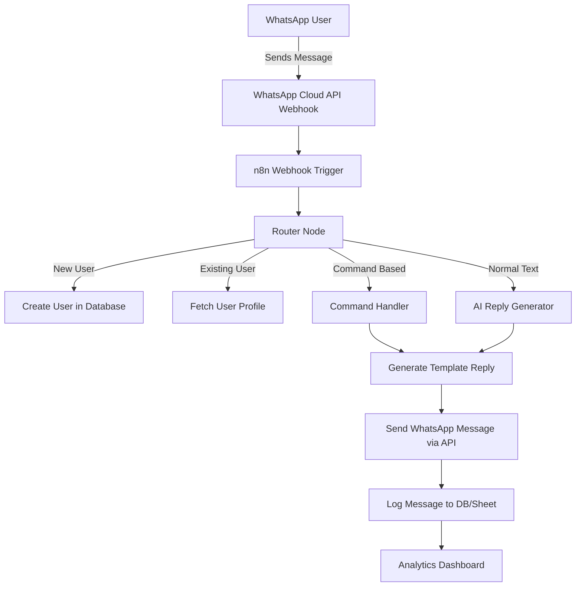

# 🚀 n8n WhatsApp Automation Workflows (Redmi Edition)

<div align="center">


[]

</div>

---

## 🌟 Overview

This repository contains a collection of **WhatsApp automation workflows** built using **n8n**, optimized for Redmi users or WhatsApp business automation setups.
Key features include:

* Auto reply to messages using **templates** or **AI**
* Dynamic **user database tracking**
* Command-based responses (like `/help`, `/menu`)
* Logging and analytics
* Fully compatible with **n8n Webhook & WhatsApp Cloud API**

---

## 🚀 Workflow Architecture



---

## 💻 How It Works

1. **User Sends Message:** Any WhatsApp user sends a message to your number.
2. **Webhook Trigger:** WhatsApp Cloud API forwards the message to n8n.
3. **Routing:** The workflow checks if the user exists, then decides which branch to follow.
4. **Reply Generation:**

   * **Template Reply:** Predefined responses for commands like `/help`, `/menu`
   * **AI Reply:** Smart AI-generated responses for normal messages
5. **Send Response:** Reply is sent back via WhatsApp Cloud API.
6. **Logging & Analytics:** All messages are logged in DB/Sheet for insights.

---

## 🏗️ Tech Stack

* **Automation Platform:** n8n
* **Messaging API:** WhatsApp Cloud API
* **Database:** SQLite / Google Sheets / Airtable
* **AI Engine:** OpenAI (optional for smart replies)
* **Deployment:** Docker / Local Server

---

## 📂 Repo Structure

```
n8n-whatsapp-automation/
├── workflows/          # n8n workflow JSONs
│   ├── whatsapp-webhook.json
│   ├── ai-reply.json
│   └── template-reply.json
├── db/                 # User data and logs
├── scripts/            # Optional helper scripts
└── README.md
```

---

## 🤝 Contributing

* 🐛 Report bugs via **Issues**
* 💡 Suggest features via **Discussions**
* 📝 Add new workflow JSONs for WhatsApp automation
* ⭐ Star the repo to support development

---

## 🔒 Security

* ✅ Input validation & sanitization
* ✅ Webhook authentication
* ✅ Rate limiting & logging
* ✅ Non-root Docker container deployment

---

## 💖 Support

<div align="center">

[](https://www.buymeacoffee.com/zie619)

</div>

# 🚀 n8n WhatsApp Automation Workflows (Redmi Edition)

<div align="center">


[](https://www.buymeacoffee.com/zie619)

</div>

---

## 🌟 Overview

This repository contains a collection of **WhatsApp automation workflows** built using **n8n**, optimized for Redmi users or WhatsApp business automation setups.
Key features include:

* Auto reply to messages using **templates** or **AI**
* Dynamic **user database tracking**
* Command-based responses (like `/help`, `/menu`)
* Logging and analytics
* Fully compatible with **n8n Webhook & WhatsApp Cloud API**

---

## 🚀 Workflow Architecture


---

## 💻 How It Works

1. **User Sends Message:** Any WhatsApp user sends a message to your number.
2. **Webhook Trigger:** WhatsApp Cloud API forwards the message to n8n.
3. **Routing:** The workflow checks if the user exists, then decides which branch to follow.
4. **Reply Generation:**

   * **Template Reply:** Predefined responses for commands like `/help`, `/menu`
   * **AI Reply:** Smart AI-generated responses for normal messages
5. **Send Response:** Reply is sent back via WhatsApp Cloud API.
6. **Logging & Analytics:** All messages are logged in DB/Sheet for insights.

---

## 🏗️ Tech Stack

* **Automation Platform:** n8n
* **Messaging API:** WhatsApp Cloud API
* **Database:** SQLite / Google Sheets / Airtable
* **AI Engine:** OpenAI (optional for smart replies)
* **Deployment:** Docker / Local Server

---

## 📂 Repo Structure

```
n8n-whatsapp-automation/
├── workflows/          # n8n workflow JSONs
│   ├── whatsapp-webhook.json
│   ├── ai-reply.json
│   └── template-reply.json
├── db/                 # User data and logs
├── scripts/            # Optional helper scripts
└── README.md
```

---

## 🤝 Contributing

* 🐛 Report bugs via **Issues**
* 💡 Suggest features via **Discussions**
* 📝 Add new workflow JSONs for WhatsApp automation
* ⭐ Star the repo to support development

---

## 🔒 Security

* ✅ Input validation & sanitization
* ✅ Webhook authentication
* ✅ Rate limiting & logging
* ✅ Non-root Docker container deployment

---

## 💖 Support

<div align="center">

[](https://www.buymeacoffee.com/zie619)

</div>
 <h3 align="center">Passionate Competitive Programmer</h3>
<div align="center">

  <h3>Passionate Competitive Programmer</h3>

  

</div>

